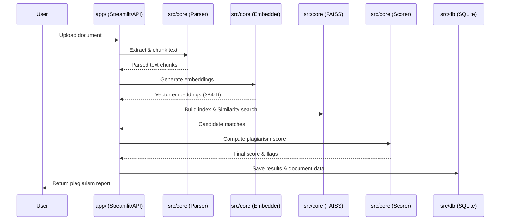
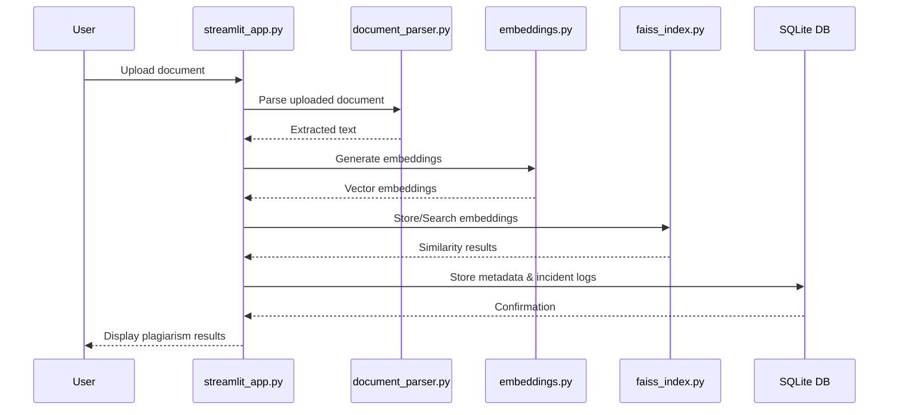

# Architecture Overview

This document explains the high-level architecture, data flow, and subsystem responsibilities of the Semantic Plagiarism Detection System.

## High-Level Architecture

The following sequence diagram illustrates the core data flow when a user uploads a document for plagiarism detection:

## Request Flow

1. **Document Upload**: The user uploads a document (PDF, DOCX, TXT) via the Streamlit dashboard or API.
2. **Text Extraction & Chunking**: The system extracts the raw text. Scanned PDFs are optionally processed with OCR. The text is then split into paragraph-sized chunks to detect localized plagiarism.
3. **Embedding Generation**: The text chunks are passed to the `SentenceTransformer` model (`paraphrase-multilingual-MiniLM-L12-v2`), which outputs L2-normalized semantic vector embeddings.
4. **FAISS Indexing & Search**: These embeddings are indexed using FAISS (`IndexFlatIP` or `IndexIVFFlat`). The system searches the index for similar chunks across the entire document corpus.
5. **Similarity Scoring**: The system computes similarity at two levels:
   - *Chunk-level*: Pairwise cosine similarity between text chunks.
   - *Document-level*: Cosine similarity between mean-pooled document embeddings.
6. **Persistence**: The original document metadata, chunk texts, and vector embeddings are saved to the local SQLite database.
7. **Reporting**: The final plagiarism flags, severity levels, and matched chunks are returned to the user through interactive visualizations.

---

## Directory Responsibilities

### `app/`

**Purpose**: The user interface and primary entry point.
- Hosts the Streamlit dashboard (`streamlit_app.py`) and UI themes (`theme.py`).
- Orchestrates the backend modules (parsing, embedding, search, scoring) based on user interactions.
- Displays plagiarism warnings, heatmaps, and analytics.

### `src/core/`

**Purpose**: The core processing and natural language processing logic.
- **Document Parsing (`document_parser.py`)**: Extracts text from PDFs and Word documents, using Tesseract OCR for scanned pages.
- **Text Chunking (`text_chunking.py`)**: Splits documents into semantically meaningful chunks (paragraphs).
- **Embedding Model (`embedding_model.py`)**: Wraps the Hugging Face `SentenceTransformer` to generate semantic vectors.
- **FAISS Search (`faiss_index.py`, `faiss_indexer.py`)**: Handles building the FAISS index and querying for semantic similarity.
- **Similarity Scoring (`similarity.py`)**: Calculates cosine similarity and flags potential plagiarism based on thresholds.

### `src/db/`

**Purpose**: Local persistent storage and data management.
- **Corpus DB (`corpus_db.py`)**: SQLite interface for storing document metadata, chunk text, and raw embedding BLOBs.
- **Auth DB (`auth.py`)**: Manages user authentication, roles (Admin/Teacher), and passwords.
- **Migrations (`migrations/`)**: Handles versioned SQLite schema upgrades.

### `src/security/`

**Purpose**: Application security and safety.
- **SSRF Protection (`ssrf_protector.py`)**: Validates URLs to prevent Server-Side Request Forgery attacks.
- **MIME Validation (`mime_validator.py`)**: Verifies uploaded file types to prevent malicious uploads.
- **Metadata Stripping (`metadata_stripper.py`)**: Removes sensitive metadata from files.

### `src/utils/`

**Purpose**: Shared helper functions and generic utilities.
- Contains modules for caching (`redis_cache.py`), file naming (`filename.py`), report generation (`pdf_report.py`, `excel_export.py`), and managing temporary files (`temp_manager.py`).

### `src/visualization/`

**Purpose**: Data visualization generation.
- Generates the interactive Plotly and Seaborn visual components used in the dashboard.
- Includes modules for heatmaps (`heatmap.py`), network graphs (`network_graph.py`), and analytics charts (`analytics.py`).

---

## Database Relationships

The system relies on a relational schema in `corpus.db` to maintain the relationships between documents and their contents:
- **`documents`**: The parent table containing `filename`, `file_hash`, and upload metadata.
- **`chunks`**: The child table linking back to `documents` via `filename`. It stores the raw `chunk_text` and the binary `embedding` vector.

## Search Pipeline

FAISS (`faiss-cpu`) is used for the vector search pipeline. Depending on the size of the corpus, it dynamically switches from `IndexFlatIP` (exact search) to `IndexIVFFlat` (approximate nearest neighbors).

## Embedding Pipeline

The system uses `paraphrase-multilingual-MiniLM-L12-v2`. This model was chosen for its high accuracy in detecting semantic similarities across multiple languages while maintaining a fast execution speed locally.

## Scoring Pipeline

Scoring happens at two levels:
1. **Document-Level**: Chunk embeddings are mean-pooled into a single vector per document. Cosine similarity is computed between these document vectors.
2. **Chunk-Level**: Computes the maximum pairwise cosine similarity between individual chunks of two documents to detect localized plagiarism.
Based on configured thresholds (e.g. 0.75 for Medium, 0.90 for High), the scoring pipeline flags plagiarized documents.

## System Architecture Diagram

The following Mermaid sequence diagram illustrates the flow of a document through the application, from upload to storage and incident logging.

