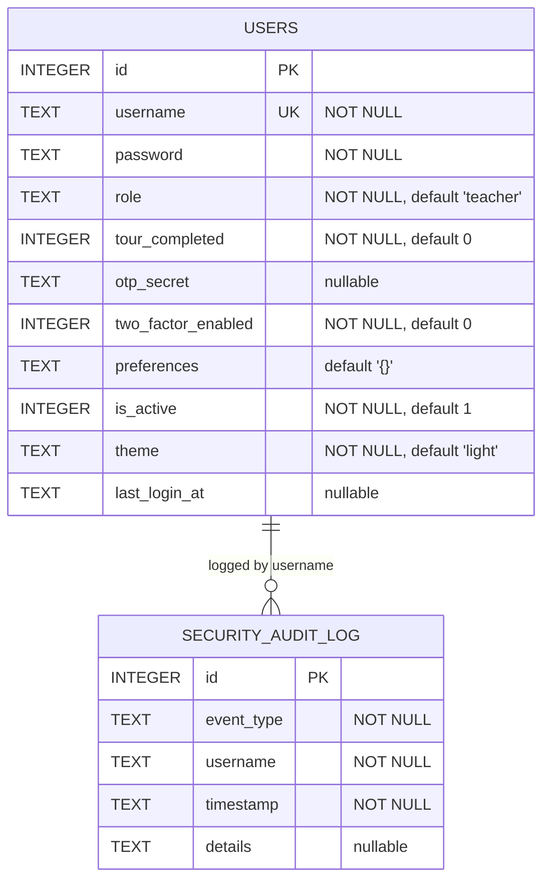
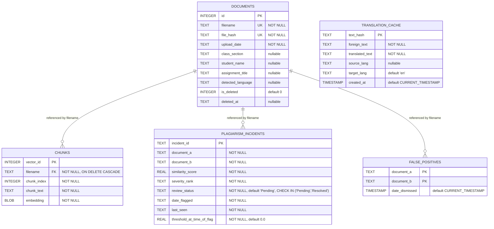

# Database Schema

This project uses two SQLite databases: `users.db` (authentication) and `corpus.db` (documents, embeddings, and plagiarism incidents).

## users.db



**Indices:** `idx_users_role` (users.role), `idx_audit_log_username` (security_audit_log.username), `idx_audit_log_event_type` (security_audit_log.event_type)

> Note: `security_audit_log.username` is not a declared SQL foreign key (no `REFERENCES` clause), it's only linked by convention.

## corpus.db



**Indices:** `idx_documents_upload_date`, `idx_documents_class_section`, `idx_chunks_filename`, `idx_incidents_status`, `idx_translation_cache_created_at`

> Note: `chunks.filename`, `plagiarism_incidents.document_a/document_b`, and `false_positives.document_a/document_b` all reference `documents.filename` logically; only `chunks.filename` is enforced with a real `FOREIGN KEY ... ON DELETE CASCADE`.

## Incident pagination

`get_all_incidents()` returns a maximum of 50 visible incidents by default.
Use `limit` and `offset` to request additional pages:

```python
from src.db.incidents import (
    get_all_incidents,
    get_total_incidents_count,
)

total = get_total_incidents_count()
first_page = get_all_incidents(limit=50, offset=0)
second_page = get_all_incidents(limit=50, offset=50)
```

Pagination uses stable ordering by descending flag date and ascending incident
ID. Both the page query and total count exclude incidents linked to
soft-deleted documents.
