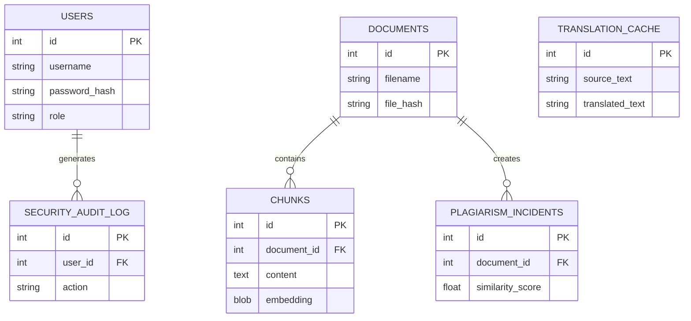

# Database Schema Documentation

## Overview

The Semantic Plagiarism Detector uses SQLite databases for persistent storage.

The database layer contains:

- User authentication data
- Documents and text chunks
- Plagiarism detection incidents
- Translation cache data

---

# Entity Relationship Diagram



# Tables and Columns

users
Stores application user authentication information.

| Column | Type | Description |
|---|---|---|
| id | INTEGER | Primary key |
| username | TEXT | Unique username |
| password_hash | TEXT | Encrypted password hash |
| role | TEXT | User role |
| created_at | TIMESTAMP | Account creation time |

# security_audit_log

Stores security-related user actions.

| Column | Type | Description |
|---|---|---|
| id | INTEGER | Primary key |
| user_id | INTEGER | Associated user |
| action | TEXT | Performed action |
| timestamp | TIMESTAMP | Event time |

# documents

Stores uploaded document metadata.

| Column | Type | Description |
|---|---|---|
| id | INTEGER | Primary key |
| filename | TEXT | Uploaded file name |
| file_hash | TEXT | Document hash |
| created_at | TIMESTAMP | Upload timestamp |

# chunks

Stores processed document text chunks and embeddings.

| Column | Type | Description |
|---|---|---|
| id | INTEGER | Primary key |
| document_id | INTEGER | Related document |
| content | TEXT | Extracted text chunk |
| embedding | BLOB | Vector embedding data |

# plagiarism_incidents

Stores detected plagiarism cases.

| Column | Type | Description |
|---|---|---|
| id | INTEGER | Primary key |
| document_id | INTEGER | Related document |
| similarity_score | FLOAT | Similarity percentage |
| status | TEXT | Review status |

# translation_cache

Stores cached translation results.

| Column | Type | Description |
|---|---|---|
| id | INTEGER | Primary key |
| source_text | TEXT | Original text |
| translated_text | TEXT | Translated output |
| language | TEXT | Target language |

# Table Relationships

Relationship Description
users → security_audit_log One user can generate multiple audit records
documents → chunks One document contains multiple text chunks
documents → plagiarism_incidents One document can have multiple plagiarism records

# Foreign Keys

| Table | Column | References |
|---|---|---|
| security_audit_log | user_id | users.id |
| chunks | document_id | documents.id |
| plagiarism_incidents | document_id | documents.id |

# Indexes

The SQLite database uses indexes to improve query performance.

 | Table | Indexed Field | Purpose |
|---|---|---|
| users | username | Faster user lookup |
| documents | file_hash | Faster duplicate document detection |
| chunks | document_id | Faster document chunk retrieval |
| plagiarism_incidents | document_id | Faster incident lookup |

```
