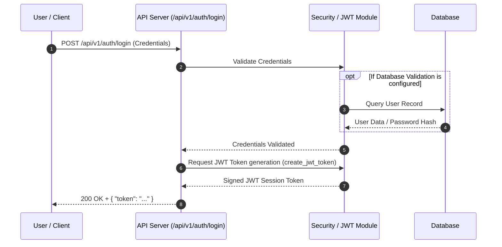
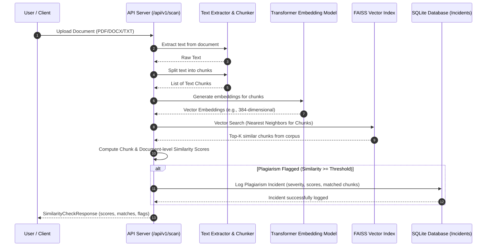

# Sequence Diagrams

System interactions for core workflows in the Semantic Plagiarism Detector.

## 1. Authentication (Login)

JWT token generation flow via `/api/v1/auth/login`.

## 2. Document Scan & Incident Logging

Processing flow for `/api/v1/scan` including text extraction, transformer embeddings, FAISS vector search, and SQLite incident logging.

